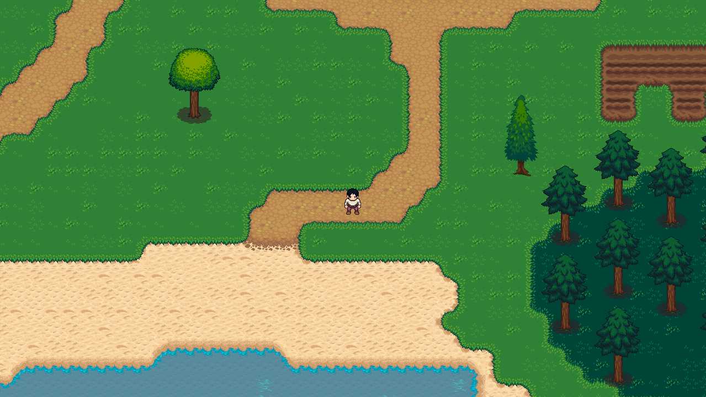

# Unnamed RPG

## A game in SDL2

#### Warm welcome and my sincerest yo.

A RPG written in pure C++ without any using any game or physics engine, a decision I will regret later on. Also, the only way I could sanely spend the big quarantine of 2020 without becoming a braindead piggy.




All maps are made in Tiled and parsed in C++ using tmxlite.

### Prerequisites

Install and configure these first :

* SDL2
* SDL2_image
* tmxlite

### How to compile and run

I've only tried running it on linux. Don't think it'll compile elsewhere. You can try tho.

```bash
    git clone https://github.com/RitwickVerma/RPG
    cd RPG
    make all
    make run
```

### Credits

* Resources
  * [SDL2](https://wiki.libsdl.org/) - C++ wrapper for OpenGL and Direct3D
  * [TmxLite](https://github.com/fallahn/tmxlite) - C++ library to parse [Tiled](https://github.com/bjorn/tiled) Maps
  * [OpenGameArt !](https://opengameart.org) - Incredible game art library
* TileSets
  * [[LPC] Plant Repack](https://opengameart.org/content/lpc-plant-repack)
  * [[LPC] Terrains](https://opengameart.org/content/lpc-terrains) - bluecarrot16 is a god amongst humans
* SpriteSheets
  * [Universal LPC SpriteSheet Generator](https://opengameart.org/content/lpc-terrains)

I have also included a credits.txt but man I can't thank these people enough for the incredible free art mainly because I'm bad at art.
