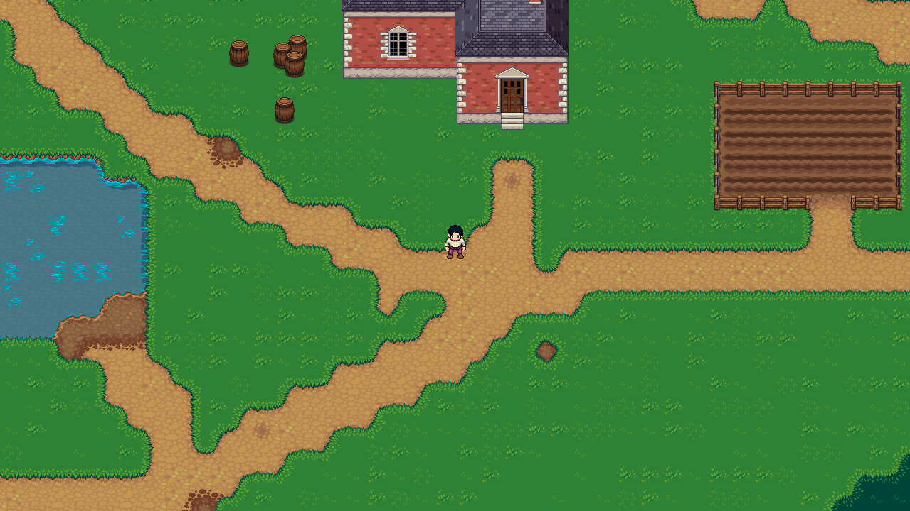

# Unnamed RPG

## A game in SDL2
##### Welcome folks and idiots (except you mom)
Only way I could sanely spend the big quarantine of 2020 without becoming a braindead piggy. To be fair, it's an incredible learning process. From implementing camera to loading a 512x31488 texture onto GPU (Not really, it's not possible and I spent 3 days on that) Now, If you are -

* Random github lurker : Help a dude out and star. or not. We're all gonna die someday anyway (please star regardless)
* Someone who knows me : Hi
* Bojack Horseman : I'm a big fan <3
* A virgin : HighFive!
* A recuriter : See? me do the code. call me maybe?
* My close friend/ animelover : [See point 4]



All maps are made in Tiled and parsed in C++ using tmxlite. Also, I didn't use a physics engine. I know I'll regret that decision.

### Prerequisites

Install and configure these first :

* SDL2
* SDL2_image
* tmxlite

### How to compile and run

I've only tried running it on linux. Don't think it'll compile elsewhere. You can try tho.

```bash
    git clone https://github.com/RitwickVerma/RPG
    cd RPG
    make all
    make run
```

### Credits

* Resources
  * [SDL2](https://wiki.libsdl.org/) - C++ wrapper for OpenGL and Direct3D
  * [TmxLite](https://github.com/fallahn/tmxlite) - C++ library to parse [Tiled](https://github.com/bjorn/tiled) Maps
  * [OpenGameArt !](https://opengameart.org) - Incredible game art library
* TileSets
  * [[LPC] Plant Repack](https://opengameart.org/content/lpc-plant-repack)
  * [[LPC] Terrains](https://opengameart.org/content/lpc-terrains) - bluecarrot16 is a god amongst humans
* SpriteSheets
  * [Universal LPC SpriteSheet Generator](https://opengameart.org/content/lpc-terrains)

I have also included a credits.txt but man I can't thank these people enough for the incredible free art mainly because I'm shit at art.
